## Investigating whether more data is always beneficial when training machine learning models

### 1. Introduction
This report uses an over simplistic concept of an artificial intelligence model and data usage to demostrate the effects 
of increased data set size on the model's performance. A simple search of how much data exists currently on the world wide web 
results in varying values and estimates, depending on wording of the question one might see ranges from over a hundread zettabytes 
to defining petabytes, all without references for the origin of their numbers. One such claim comes from BBC, claiming that 
"the big four store at least 1,200 petabytes between them" (Mitchell, https://www.sciencefocus.com/future-technology/how-much-data-is-on-the-internet). 
Regardless, the illustration of the situation is clear, there is more data both in existence and being generated every second 
than what puny little human minds can imagine. Yet much emphasis is placed on creating more data originating from the idea 
that the industry is running out of data to train AI models on (https://theconversation.com/researchers-warn-we-could-run-out-of-data-to-train-ai-by-2026-what-then-216741). 
Whilst this particular article is dated and did not age too well for this report, written in 2026, Big AI is still training new models without 
the sky falling down. 

Whilst it is unrealistic to investigate whether there exists too much data, this study proposes an alternative. Using a 10-Class
CNN classification model and a small set of commonly used data set in the machine learning community. The goal is to challenge the 
assumptions conceived regarding the amount of data needed for a _good_ model. This report investigates three specific representations 
of increased data in model training. These are incrementals of clean data, incrementals of data containing noise and incrementals 
of data mapped with respect to number of classes.

### 2. Methodology
To emphasise the effect of increased data, all other variables are set (see config.py). This includes the
architecture of the model which is a 3-layer CNN, a relatively generic model for image detection. Other controlled
variables include learning rate and weight decay rate, number of epoch, batch size, early stopping patience, drop out
level, seeds and data set.

| Hyperparameter          | Value                                                                                                                                                                          |
|-------------------------|--------------------------------------------------------------------------------------------------------------------------------------------------------------------------------|
| dropout                 | 0.5                                                                                                                                                                            |
| epochs                  | 50                                                                                                                                                                             |
| early stopping patience | 10                                                                                                                                                                             |
| learning rate           | 0.001                                                                                                                                                                          |
| weight decay            | 0.0001                                                                                                                                                                         |
| seeds                   | [14994796, 20194682, 31380194, 73962792, 99719928]                                                                                                                             |
| CNN layer 1             | input: 1 channel (grayscale), Output: 32 channels, 3x3 kernel with padding=1, batch normalization=32, ReLU activation, 2x2 max pooling (reduces spatial dimensions by half)    |
| CNN layer 2             | input: 32 channel (grayscale), Output: 64 channels, 3x3 kernel with padding=1, batch normalization=64, ReLU activation, 2x2 max pooling (reduces spatial dimensions by half)   |
| CNN layer 3             | input: 64 channel (grayscale), Output: 128 channels, 3x3 kernel with padding=1, batch normalization=128, ReLU activation, 2x2 max pooling (reduces spatial dimensions by half) |
| Classifier layer        | default flatten, linear 128*3*3 input features to 256 output features, ReLU activation, dropout of 0.5, linear 256 features into number of classes                             |
| Validation split        | 0.1 of training data set                                                                                                                                                       |
| Training data set       | 60 000 images total                                                                                                                                                            |
| Test data set           | 10 000 images total                                                                                                                                                            |
| Data set                | Fashion-MNIST                                                                                                                                                                               |

Table ?: List of hyperparameters fixed for all experiments.

Each seed is considered a unique run of the experiment. Effectively, each condition is tested five times and the averaged
metrics of all five are used in the conclusion. See Appendix for raw data.

#### 2.1 Increasing amount of clean training data for a 10-class CNN
The experiment randomly samples the training data using 5% to 100% of each class's training data to train the model to
maintain class distribution. All ten classes are used and models are to predict all ten classes.

The hypothesis is that increasing the amount of data will have limited effects on model performance beyond a certain threshold, thus the point
of diminishing returns. Unlike the intuition of the scaling law which typically predicts a linear proportional relationship, 
a model can only learn so much from the data it has due to the limits of current architecture infrastructure and thus there
exists a point whereby a model can consume too much data with little improvement. The performance metrics should show a
relatively substantial increase initially from the point of not enough data to an optimal point, then the increase in performance
metrics slow drastically and perhaps even decrease due to overfitting.

The null hypothesis is that the change in performance metrics does not substantially slow down as the data increases beyond a certain threshold.

| Percentage (%) | Training data amount | Validation data amount |
|----------------|----------------------|------------------------|
| 5              | 2 700                | 300                    |
| 10             | 5 400                | 600                    |
| 15             | 9 000                | 900                    |
| 20             | 11 800               | 1 200                  |
| 25             | 14 500               | 1 500                  |
| 30             | 16 200               | 1 800                  |
| 35             | 18 900               | 2 100                  |
| 40             | 21 600               | 2 400                  |
| 45             | 24 300               | 2 700                  |
| 50             | 27 000               | 3 000                  |
| 55             | 29 700               | 3 300                  |
| 60             | 32 400               | 3 600                  |
| 65             | 35 100               | 3 900                  |
| 70             | 37 800               | 4 200                  |
| 75             | 40 500               | 4 500                  |
| 80             | 43 200               | 4 800                  |
| 85             | 45 900               | 5 100                  |
| 90             | 48 600               | 5 400                  |
| 95             | 51 300               | 5 700                  |
| 100            | 54 000               | 6 000                  |
Table ?: Number of images used for training and validation per pecentage.

The experiment 1 script systematically samples data randomly whilst keeping the distribution of the classes, using a seed. 
For each data size condition, a model is trained and evaluated. The result looks at the aggregation of all metrics across all models and data size conditions.

#### 2.2 Increased training data contains varying amounts of noise for a 10-class CNN
Models are typically considered in the context of a perfect world, with clean and clear data sets. Building on top of 
the first experiment, this experiment explores the effect of noisy data's ratio to clean data on model performance.

The hypothesis is that the cleaner the data, the better the performance. Noisier data will cause model performance to decrease.

The null hypothesis is that adding noisy data would not change the performance of the models significantly and the 
results would look similar to that of experiment 1.

The 0% noisy data results came from experiment 1 to save on time and resources.

| Data set parameter                                   | Value ranges                                     |
|------------------------------------------------------|--------------------------------------------------|
| Number of clean data                                 | 30 000 (fixed)                                   |
| Probability that a label is flipped (noise rate (%)) | [0.05, 0.10, 0.15, 0.20, 0.25, 0.30, 0.35, 0.40] |
| Rate of noisy data to clean data  (%)                | [0, 5, 10, 15, 20, 25, 30, 35, 40, 45, 50]       |
Table (?): Parameters specific to experiment 2 (see config.py).

| Noisy Percentage (%) | Added Noisy Data | Noise Rate (%) | Data with flipped label (estimated) | Total data |
|----------------------|------------------|----------------|-------------------------------------|------------| 
| 5                    | 3 000            | 5              | 150                                 | 33 000     |
| 5                    | 3 000            | 10             | 300                                 | 33 000     |
| 5                    | 3 000            | 15             | 450                                 | 33 000     |
| 5                    | 3 000            | 20             | 600                                 | 33 000     |
| 5                    | 3 000            | 25             | 750                                 | 33 000     |
| 5                    | 3 000            | 30             | 900                                 | 33 000     |
| 5                    | 3 000            | 35             | 1 200                               | 33 000     |
| 5                    | 3 000            | 40             | 1 500                               | 33 000     |
| 10                   | 6 000            | 5              | 300                                 | 36 000     |
| 10                   | 6 000            | 10             | 600                                 | 36 000     |
| 10                   | 6 000            | 15             | 900                                 | 36 000     |
| 10                   | 6 000            | 20             | 1 200                               | 36 000     |
| 10                   | 6 000            | 25             | 1 500                               | 36 000     |
| 10                   | 6 000            | 30             | 1 800                               | 36 000     |
| 10                   | 6 000            | 35             | 2 100                               | 36 000     |
| 10                   | 6 000            | 40             | 2 400                               | 36 000     |
| 15                   | 9 000            | 5              | 450                                 | 39 000     |
| 15                   | 9 000            | 10             | 900                                 | 39 000     |
| 15                   | 9 000            | 15             | 1 350                               | 39 000     |
| 15                   | 9 000            | 20             | 1 800                               | 39 000     |
| 15                   | 9 000            | 25             | 2 250                               | 39 000     |
| 15                   | 9 000            | 30             | 2 700                               | 39 000     |
| 15                   | 9 000            | 35             | 3 150                               | 39 000     |
| 15                   | 9 000            | 40             | 3 600                               | 39 000     |
| 20                   | 12 000           | 5              | 600                                 | 42 000     |
| 20                   | 12 000           | 10             | 1 200                               | 42 000     |
| 20                   | 12 000           | 15             | 1 800                               | 42 000     |
| 20                   | 12 000           | 20             | 2 400                               | 42 000     |
| 20                   | 12 000           | 25             | 3 000                               | 42 000     |
| 20                   | 12 000           | 30             | 3 600                               | 42 000     |
| 20                   | 12 000           | 35             | 4 200                               | 42 000     |
| 20                   | 12 000           | 40             | 4 800                               | 42 000     |
| 25                   | 15 000           | 5              | 750                                 | 45 000     |
| 25                   | 15 000           | 10             | 1 500                               | 45 000     |
| 25                   | 15 000           | 15             | 2 250                               | 45 000     |
| 25                   | 15 000           | 20             | 3 000                               | 45 000     |
| 25                   | 15 000           | 25             | 3 750                               | 45 000     |
| 25                   | 15 000           | 30             | 4 500                               | 45 000     |
| 25                   | 15 000           | 35             | 5 250                               | 45 000     |
| 25                   | 15 000           | 40             | 6 000                               | 45 000     |
| 30                   | 18 000           | 5              | 900                                 | 48 000     |
| 30                   | 18 000           | 10             | 1 800                               | 48 000     |
| 30                   | 18 000           | 15             | 2 700                               | 48 000     |
| 30                   | 18 000           | 20             | 3 600                               | 48 000     |
| 30                   | 18 000           | 25             | 4 500                               | 48 000     |
| 30                   | 18 000           | 30             | 5 400                               | 48 000     |
| 30                   | 18 000           | 35             | 6 300                               | 48 000     |
| 30                   | 18 000           | 40             | 7 200                               | 48 000     |
| 35                   | 21 000           | 5              | 1 050                               | 51 000     |
| 35                   | 21 000           | 10             | 2 100                               | 51 000     |
| 35                   | 21 000           | 15             | 3 150                               | 51 000     |
| 35                   | 21 000           | 20             | 4 200                               | 51 000     |
| 35                   | 21 000           | 25             | 5 250                               | 51 000     |
| 35                   | 21 000           | 30             | 6 300                               | 51 000     |
| 35                   | 21 000           | 35             | 7 350                               | 51 000     |
| 35                   | 21 000           | 40             | 8 400                               | 51 000     |
| 40                   | 24 000           | 5              | 1 200                               | 54 000     |
| 40                   | 24 000           | 10             | 2 400                               | 54 000     |
| 40                   | 24 000           | 15             | 3 600                               | 54 000     |
| 40                   | 24 000           | 20             | 4 800                               | 54 000     |
| 40                   | 24 000           | 25             | 6 000                               | 54 000     |
| 40                   | 24 000           | 30             | 7 200                               | 54 000     |
| 40                   | 24 000           | 35             | 8 400                               | 54 000     |
| 40                   | 24 000           | 40             | 9 600                               | 54 000     |
| 45                   | 27 000           | 5              | 1 350                               | 57 000     |
| 45                   | 27 000           | 10             | 2 700                               | 57 000     |
| 45                   | 27 000           | 15             | 4 050                               | 57 000     |
| 45                   | 27 000           | 20             | 5 400                               | 57 000     |
| 45                   | 27 000           | 25             | 6 750                               | 57 000     |
| 45                   | 27 000           | 30             | 8 100                               | 57 000     |
| 45                   | 27 000           | 35             | 9 450                               | 57 000     |
| 45                   | 27 000           | 40             | 10 800                              | 57 000     |
| 50                   | 30 000           | 5              | 1 500                               | 60 000     |
| 50                   | 30 000           | 10             | 3 000                               | 60 000     |
| 50                   | 30 000           | 15             | 4 500                               | 60 000     |
| 50                   | 30 000           | 20             | 6 000                               | 60 000     |
| 50                   | 30 000           | 25             | 7 500                               | 60 000     |
| 50                   | 30 000           | 30             | 9 000                               | 60 000     |
| 50                   | 30 000           | 35             | 10 500                              | 60 000     |
| 50                   | 30 000           | 40             | 12 000                              | 60 000     |
Table (?): Expanded list of combinations of noise percentage to noise rates and absolute value of training data used

Using the same seeds as experiment, the data is randomly sampled for the clean data set and for the noisy. A noisy data has 
is clean data where every data point has a chance of having its labels flipped. This chance is determined by the noise rate. 
For every row condition in table (?) above, a model was trained for each seed (total of 5) and evaluated. The results are
an aggregate analysis of all models' metrics.

#### 2.3 Increased training data and its effects on differing numbers of classes for a classification CNN
The results of experiment 1 and experiment 2 opens the question to whether the effects are the same with varying numbers of classes.
To further control this experiment, only clean data was used to emphasise the effect of number of classes.

The hypothesis is that fewer classes to be classified by the model, the less data required. Thus, the performance metrics should show 
better performance

For each number of classes, the labels are sample randomly for five combinations to account for the variation in the object itself
and the ease of differentiating for different classes. This allows the possibility for classes that are easily differentiated to be 
paired together with the same likelihood as classes that are difficult to differentiate, making the groupings effectively arbitrary.

| Number of Classes | Percentage of total data per class | Total data set size |
|-------------------|------------------------------------|---------------------|
| 2                 | 10                                 | 600                 |
| 2                 | 20                                 | 1 200               |
| 2                 | 30                                 | 1 800               |
| 2                 | 40                                 | 2 400               |
| 2                 | 50                                 | 3 000               |
| 2                 | 60                                 | 3 600               |
| 2                 | 70                                 | 4 200               |
| 2                 | 80                                 | 4 800               |
| 2                 | 90                                 | 5 400               |
| 2                 | 100                                | 6 000               |
| 3                 | 10                                 | 900                 |
| 3                 | 20                                 | 1 800               |
| 3                 | 30                                 | 2 700               |
| 3                 | 40                                 | 3 600               |
| 3                 | 50                                 | 4 500               |
| 3                 | 60                                 | 5 400               |
| 3                 | 70                                 | 6 300               |
| 3                 | 80                                 | 7 200               |
| 3                 | 90                                 | 8 100               |
| 3                 | 100                                | 9 000               |
| 4                 | 10                                 | 1 200               |
| 4                 | 20                                 | 2 400               |
| 4                 | 30                                 | 3 600               |
| 4                 | 40                                 | 4 800               |
| 4                 | 50                                 | 6 000               |
| 4                 | 60                                 | 7 200               |
| 4                 | 70                                 | 8 400               |
| 4                 | 80                                 | 9 600               |
| 4                 | 90                                 | 10 800              |
| 4                 | 100                                | 12 000              |
| 5                 | 10                                 | 1 500               |
| 5                 | 20                                 | 3 000               |
| 5                 | 30                                 | 4 500               |
| 5                 | 40                                 | 6 000               |
| 5                 | 50                                 | 7 500               |
| 5                 | 60                                 | 9 000               |
| 5                 | 70                                 | 10 500              |
| 5                 | 80                                 | 12 000              |
| 5                 | 90                                 | 13 500              |
| 5                 | 100                                | 15 000              |
| 6                 | 10                                 | 1 800               |
| 6                 | 20                                 | 3 600               |
| 6                 | 30                                 | 5 400               |
| 6                 | 40                                 | 7 200               |
| 6                 | 50                                 | 9 000               |
| 6                 | 60                                 | 10 800              |
| 6                 | 70                                 | 12 600              |
| 6                 | 80                                 | 14 400              |
| 6                 | 90                                 | 16 200              |
| 6                 | 100                                | 18 000              |
| 7                 | 10                                 | 2 100               |
| 7                 | 20                                 | 4 200               |
| 7                 | 30                                 | 6 300               |
| 7                 | 40                                 | 8 400               |
| 7                 | 50                                 | 10 500              |
| 7                 | 60                                 | 12 600              |
| 7                 | 70                                 | 14 700              |
| 7                 | 80                                 | 16 800              |
| 7                 | 90                                 | 18 900              |
| 7                 | 100                                | 21 000              |
| 8                 | 10                                 | 2 400               |
| 8                 | 20                                 | 4 800               |
| 8                 | 30                                 | 7 200               |
| 8                 | 40                                 | 9 600               |
| 8                 | 50                                 | 12 000              |
| 8                 | 60                                 | 14 400              |
| 8                 | 70                                 | 16 800              |
| 8                 | 80                                 | 19 200              |
| 8                 | 90                                 | 21 600              |
| 8                 | 100                                | 24 000              |
| 9                 | 10                                 | 2 700               |
| 9                 | 20                                 | 5 400               |
| 9                 | 30                                 | 8 100               |
| 9                 | 40                                 | 10 800              |
| 9                 | 50                                 | 13 500              |
| 9                 | 60                                 | 16 200              |
| 9                 | 70                                 | 18 900              |
| 9                 | 80                                 | 21 600              |
| 9                 | 90                                 | 24 300              |
| 9                 | 100                                | 27 000              |
| 10                | 10                                 | 3 000               |
| 10                | 20                                 | 6 000               |
| 10                | 30                                 | 9 000               |
| 10                | 40                                 | 12 000              |
| 10                | 50                                 | 15 000              |
| 10                | 60                                 | 18 000              |
| 10                | 70                                 | 21 000              |
| 10                | 80                                 | 24 000              |
| 10                | 90                                 | 27 000              |
| 10                | 100                                | 30 000              |
Table (?): 

### 3. Results
See results folder for all graphs and JSONs files generated.

The conjugate results look at where on the graph is f(x) maximised, meaning where the data most efficiently produces the 
best results. The formulas used are as follows.

##### 3.0.1 Efficiency x and Efficiency y
Whereby metric = f(x) is given by the formula of the line of best fit, is maximised.

Efficiency_x = f(x)/x
Efficiency_y = f(efficiency_x)

The optimal point (maximised point) is discovered by taking the derivative of f(x)/x and setting it to zero and solve for x.

###### Logarithmic: $f(x) = a \ln(x) + b$

Optimization:
$$\text{Maximize: } \frac{f(x)}{x} = \frac{a \ln(x) + b}{x}$$

Take derivative:
$$\frac{d}{dx}\left[\frac{a \ln(x) + b}{x}\right] = \frac{a/x \cdot x - (a \ln(x) + b) \cdot 1}{x^2} = \frac{a - a\ln(x) - b}{x^2}$$

Set equal to zero:
$$a - a\ln(x) - b = 0$$
$$a\ln(x) = a - b$$
$$\ln(x) = 1 - \frac{b}{a}$$

**Solution**:
$$x_{\text{opt}} = e^{1 - b/a}$$
$$y_{\text{opt}} = a \ln(x_{\text{opt}}) + b$$

###### Linear: $f(x) = ax + b$

$$\frac{f(x)}{x} = a + \frac{b}{x}$$

- Maximized at $x_{\min}$ if $b \geq 0$
- Maximized at $x_{\max}$ if $b < 0$

##### 3.0.2 Knee/Elbow Point
The knee point is defined as the point on the curve that is furthest away from the diagonal line $y=x$ in normalised space. 
The mathematical intuition is that at small $x$, $y$ grows rapidly and due to its closeness to origin, the point does not end 
up very far from the $y=x$ line. When the growth of $y$ finally plateaus, the graph will converge towards (1, 1). So the point at which 
$y$ is furtherest from shows an optimal efficiency, hence the knee.

###### Normalization
 
Transform x and y to [0, 1] range:
 
$$x_{\text{norm}} = \frac{x - x_{\min}}{x_{\max} - x_{\min}}$$
 
$$y_{\text{norm}} = \frac{y - y_{\min}}{y_{\max} - y_{\min}}$$
 
###### Distance Calculation
 
Distance from the diagonal line $y = x$:
 
$$d(x) = |y_{\text{norm}}(x) - x_{\text{norm}}(x)|$$
 
###### Knee Point
 
$$x_{\text{knee}} = \arg\max_{x \in [x_{\min}, x_{\max}]} |y_{\text{norm}}(x) - x_{\text{norm}}(x)|$$
 
$$y_{\text{knee}} = f(x_{\text{knee}})$$
 
**Note**: No knee exists for linear curves

##### 3.0.3 Marginal Threshold Point
The marginal threshold looks at the marginal gain. Specifically, the threshold is the point where each additional 
sample only improves accuracy by ~0.0001 (default threshold) or less.

###### Logarithmic Curve: $f(x) = a \ln(x) + b$
 
**Derivative**:
$$\frac{dy}{dx} = \frac{a}{x}$$
 
**Set Equal to Threshold**:
$$\frac{a}{x} = \tau$$
 
**Solution**:
$$x_{\text{marginal}} = \frac{a}{\tau}$$
 
$$y_{\text{marginal}} = a \ln\left(\frac{a}{\tau}\right) + b$$
 
###### Linear Curve: $f(x) = ax + b$
 
**Derivative**:
$$\frac{dy}{dx} = a \quad \text{(constant)}$$
 
**Solution**:
- If $|a| \leq \tau$: threshold already met at $x_{\min}$ (returns `"constant"`)
- If $|a| > \tau$: threshold never met (returns `"above_thresh"`)
 
###### Power Curve: $f(x) = ax^c + b$
 
**Derivative**:
$$\frac{dy}{dx} = acx^{c-1}$$
 
**Set Equal to Threshold**:
$$acx^{c-1} = \tau$$
 
$$x^{c-1} = \frac{\tau}{ac}$$
 
**Solution** (if $c \neq 1$ and $ac > 0$):
$$x_{\text{marginal}} = \left(\frac{\tau}{ac}\right)^{\frac{1}{c-1}}$$
 
$$y_{\text{marginal}} = a\left(x_{\text{marginal}}\right)^c + b$$

#### 3.1 Increasing amount of clean training data for a 10-class CNN Results
The most obvious result is that after a certain point, the increase gained by the increment of added 
data alone no longer sufficiently improves the model's performance. All results for this experiment fcan be found under $/results/exp1$ folder. 

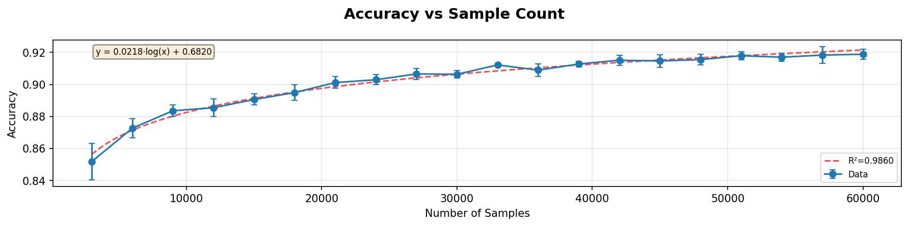
Figure (?): The effect of training data set size on model accuracy

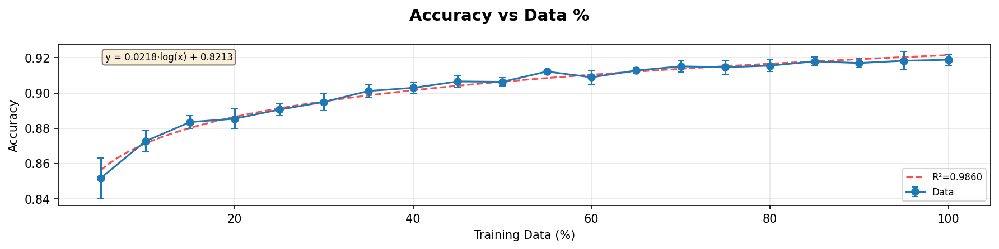
Figure (?): The effect of training data set size as a percentage of full data set available on model accuracy

Both figures portraying the accuracy of the model through this experiment showed a diminishing returns effect on accuracy displayed by the 
model as the amount of data provided for the training process increased. 

| func_type | equation               | r_squared | x_min | x_max  | efficiency_x | efficiency_y | efficiency_note | efficiency_ratio | knee_x   | knee_y | knee_note    | marginal_x | marginal_y | marginal_note | marginal_threshold | metric            | 
|-----------|------------------------|-----------|-------|--------|--------------|--------------|-----------------|------------------|----------|--------|--------------|------------|------------|---------------|--------------------|-------------------|
| log       | 0.0218·log(x) + 0.6820 | 0.986     | 3 000 | 60 000 | 3 001        | 0.8563       | analytical        | 0.00028543       | 19033.03 | 0.8965 | max_distance | 3000       | 0.8563     | dy/dx=0.0001  | 0.0001             | accuracy          |
| log       | 0.0218·log(x) + 0.6820 | 0.986     | 3 000 | 60 000 | 3 001        | 0.8563       | analytical        | 0.00028543       | 19033.03 | 0.8965 | max_distance | 3000       | 0.8563     | dy/dx=0.0001  | 0.0001             | balanced_accuracy |
| log       | 0.0220·log(x) + 0.6796 | 0.9836    | 3 000 | 60 000 | 3 001        | 0.8555       | analytical        | 0.00028516       | 19033.03 | 0.8961 | max_distance | 3000       | 0.8555     | dy/dx=0.0001  | 0.0001             | f1_macro          |
| log       | 0.0027·log(x) + 0.9658 | 0.974     | 3 000 | 60 000 | 3 001        | 0.9875       | analytical        | 0.00032918       | 19033.03 | 0.9925 | max_distance | 3000       | 0.9875     | dy/dx=0.0001  | 0.0001             | auroc_macro       |
| log       | 0.0167·log(x) + 0.7862 | 0.9806    | 3 000 | 60 000 | 3 001        | 0.9197       | analytical        | 0.00030657       | 19033.03 | 0.9505 | max_distance | 3000       | 0.9197     | dy/dx=0.0001  | 0.0001             | auprc_macro       |
| log       | 0.0240·log(x) + 0.6487 | 0.9868    | 3 000 | 60 000 | 3 001        | 0.8409       | analytical        | 0.00028031       | 19033.03 | 0.8853 | max_distance | 3000       | 0.8409     | dy/dx=0.0001  | 0.0001             | mcc               |
| log       | 0.0207·log(x) + 0.6942 | 0.9888    | 3 000 | 60 000 | 3 001        | 0.8598       | analytical        | 0.0002866        | 19033.03 | 0.8980 | max_distance | 3000       | 0.8598     | dy/dx=0.0001  | 0.0001             | precision_macro   |
| log       | 0.0218·log(x) + 0.6820 | 0.986     | 3 000 | 60 000 | 3 001        | 0.8563       | analytical        | 0.00028543       | 19033.03 | 0.8965 | max_distance | 3000       | 0.8563     | dy/dx=0.0001  | 0.0001             | recall_macro      |
Table (?): Summary table of optimal points for experiment 1

The efficiency for all performance metrics falls at the same $x$ value of 3001 data sampless. Whilst the y-value varies, it substantially 
illustrates the point that optimal efficiency of the performance metrics is low. The formula used in the code for this is normalised for the line of best fit.

The point for the knee shows the most divergent numbers from the other two metrics as it does not sit on the $x$ axis boundary for this experiment, 
instead it is at $x=19,033$. This is the point that the performance metrics improvement begin to plateau to suboptimal levels.

Marginal threshold values here are unhelpful as the line of best fit places the point at which each additional 
sample only improves accuracy by ~0.0001 (default threshold) or less at a value smaller than the minimal dataset size tested. 
Whilst this provides a good idea that even at 3000 data points, each additional sample's improvement to the model may be suboptimal.

Interestingly, the three different measures of optimal point suggests different values at which the usage of data provides the greatest improvements 
to the model's performance. This ranges from a value well below the initialising data set size (for efficiency), to being on the boundary (for marginal gain 
threshold) to a value roughly midway through the tested data set (at 19,033 or 63.4%). None of the values come anywhere close to the size of the full data set provided 
at 30, 000. This illustrates the assumption from the perspective of data set curators that perhaps too much data was provided on the assumption that a lot of data is needed. 
For classification models, the presumed amount of data required may be much higher in the minds of humans than what the model 
actually calls for. 

#### 3.2 Increased training data contains varying amounts of noise for a 10-class CNN Results

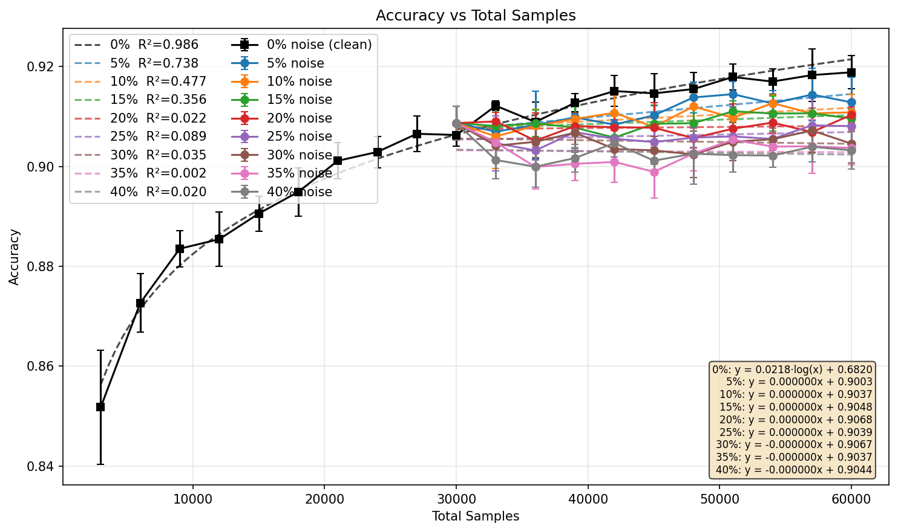
Figure (?): The effect of training data set size with varying levels of noise on model accuracy

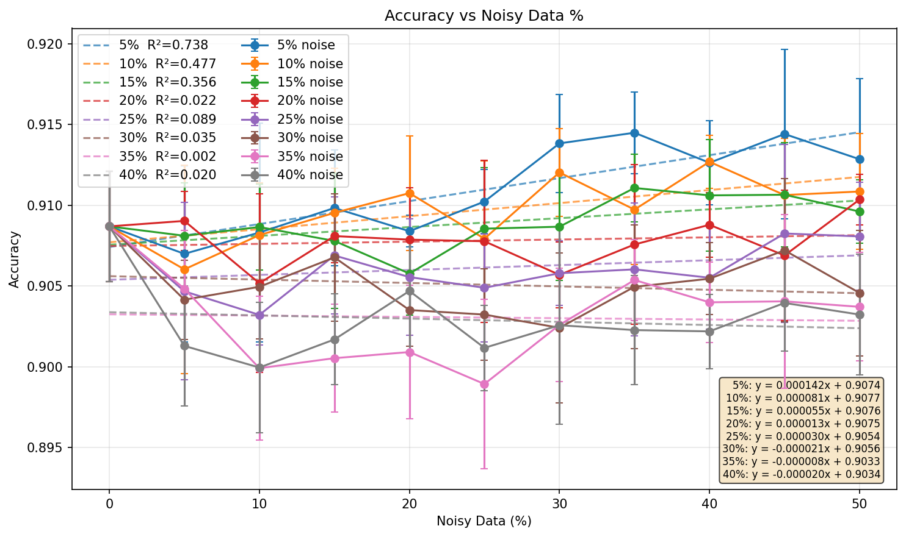
Figure (?): The effect of training data set size with varying levels of noise as a percentage of full data set available on model accuracy

| func_type | equation                   | r_squared | x_min   | x_max   | efficiency_noisy_clean_ratio | efficiency_x | efficiency_y | efficiency_note | knee_x   | knee_y | knee_note    | marginal_x | marginal_y | marginal_note | marginal_threshold | metric            | condition | noise_rate |
|-----------|----------------------------|-----------|---------|---------|------------------------------|--------------|--------------|-----------------|----------|--------|--------------|------------|------------|---------------|--------------------|-------------------|-----------|------------|
| log       | y = 0.0218·log(x) + 0.6820 | 0.986     | 3000.0  | 60000.0 |                              | 3001.0       | 0.8563       | analytical      | 19033.03 | 0.8965 | max_distance | 3000.0     | 0.8563     | dy/dx=0.0001  | 0.0001             | accuracy          | baseline  | 0.0        |
| linear    | y = 0.000000x + 0.9003     | 0.7382    | 30000.0 | 60000.0 | 1.0                          | 60000.0      | 0.9145       | numerical       |          |        | no_knee      | 30000.0    | 0.9074     | constant      | 0.0001             | accuracy          | 5% noise  | 0.05       |
| linear    | y = 0.000000x + 0.9037     | 0.4775    | 30000.0 | 60000.0 | 1.0                          | 60000.0      | 0.9118       | numerical       |          |        | no_knee      | 30000.0    | 0.9077     | constant      | 0.0001             | accuracy          | 10% noise | 0.1        |
| linear    | y = 0.000000x + 0.9048     | 0.3561    | 30000.0 | 60000.0 | 1.0                          | 60000.0      | 0.9103       | numerical       |          |        | no_knee      | 30000.0    | 0.9076     | constant      | 0.0001             | accuracy          | 15% noise | 0.15       |
| linear    | y = 0.000000x + 0.9068     | 0.0224    | 30000.0 | 60000.0 | 1.0                          | 60000.0      | 0.9082       | numerical       |          |        | no_knee      | 30000.0    | 0.9075     | constant      | 0.0001             | accuracy          | 20% noise | 0.2        |
| linear    | y = 0.000000x + 0.9039     | 0.0885    | 30000.0 | 60000.0 | 1.0                          | 60000.0      | 0.9069       | numerical       |          |        | no_knee      | 30000.0    | 0.9054     | constant      | 0.0001             | accuracy          | 25% noise | 0.25       |
| linear    | y = -0.000000x + 0.9067    | 0.0352    | 30000.0 | 60000.0 | 0.0001                       | 30002.0      | 0.9056       | numerical       |          |        | no_knee      | 30000.0    | 0.9056     | constant      | 0.0001             | accuracy          | 30% noise | 0.3        |
| linear    | y = -0.000000x + 0.9037    | 0.0022    | 30000.0 | 60000.0 | 0.0001                       | 30002.0      | 0.9033       | numerical       |          |        | no_knee      | 30000.0    | 0.9033     | constant      | 0.0001             | accuracy          | 35% noise | 0.35       |
| linear    | y = -0.000000x + 0.9044    | 0.0197    | 30000.0 | 60000.0 | 0.0001                       | 30002.0      | 0.9034       | numerical       |          |        | no_knee      | 30000.0    | 0.9034     | constant      | 0.0001             | accuracy          | 40% noise | 0.4        |
| log       | y = 0.0218·log(x) + 0.6820 | 0.986     | 3000.0  | 60000.0 |                              | 3001.0       | 0.8563       | analytical      | 19033.03 | 0.8965 | max_distance | 3000.0     | 0.8563     | dy/dx=0.0001  | 0.0001             | balanced_accuracy | baseline  | 0.0        |
| linear    | y = 0.000000x + 0.9003     | 0.7382    | 30000.0 | 60000.0 | 1.0                          | 60000.0      | 0.9145       | numerical       |          |        | no_knee      | 30000.0    | 0.9074     | constant      | 0.0001             | balanced_accuracy | 5% noise  | 0.05       |
| linear    | y = 0.000000x + 0.9037     | 0.4775    | 30000.0 | 60000.0 | 1.0                          | 60000.0      | 0.9118       | numerical       |          |        | no_knee      | 30000.0    | 0.9077     | constant      | 0.0001             | balanced_accuracy | 10% noise | 0.1        |
| linear    | y = 0.000000x + 0.9048     | 0.3561    | 30000.0 | 60000.0 | 1.0                          | 60000.0      | 0.9103       | numerical       |          |        | no_knee      | 30000.0    | 0.9076     | constant      | 0.0001             | balanced_accuracy | 15% noise | 0.15       |
| linear    | y = 0.000000x + 0.9068     | 0.0224    | 30000.0 | 60000.0 | 1.0                          | 60000.0      | 0.9082       | numerical       |          |        | no_knee      | 30000.0    | 0.9075     | constant      | 0.0001             | balanced_accuracy | 20% noise | 0.2        |
| linear    | y = 0.000000x + 0.9039     | 0.0885    | 30000.0 | 60000.0 | 1.0                          | 60000.0      | 0.9069       | numerical       |          |        | no_knee      | 30000.0    | 0.9054     | constant      | 0.0001             | balanced_accuracy | 25% noise | 0.25       |
| linear    | y = -0.000000x + 0.9067    | 0.0352    | 30000.0 | 60000.0 | 0.0001                       | 30002.0      | 0.9056       | numerical       |          |        | no_knee      | 30000.0    | 0.9056     | constant      | 0.0001             | balanced_accuracy | 30% noise | 0.3        |
| linear    | y = -0.000000x + 0.9037    | 0.0022    | 30000.0 | 60000.0 | 0.0001                       | 30002.0      | 0.9033       | numerical       |          |        | no_knee      | 30000.0    | 0.9033     | constant      | 0.0001             | balanced_accuracy | 35% noise | 0.35       |
| linear    | y = -0.000000x + 0.9044    | 0.0197    | 30000.0 | 60000.0 | 0.0001                       | 30002.0      | 0.9034       | numerical       |          |        | no_knee      | 30000.0    | 0.9034     | constant      | 0.0001             | balanced_accuracy | 40% noise | 0.4        |
| log       | y = 0.0220·log(x) + 0.6796 | 0.9836    | 3000.0  | 60000.0 |                              | 3001.0       | 0.8555       | analytical      | 19033.03 | 0.8961 | max_distance | 3000.0     | 0.8555     | dy/dx=0.0001  | 0.0001             | f1_macro          | baseline  | 0.0        |
| linear    | y = 0.000000x + 0.9005     | 0.7452    | 30000.0 | 60000.0 | 1.0                          | 60000.0      | 0.9141       | numerical       |          |        | no_knee      | 30000.0    | 0.9073     | constant      | 0.0001             | f1_macro          | 5% noise  | 0.05       |
| linear    | y = 0.000000x + 0.9032     | 0.425     | 30000.0 | 60000.0 | 1.0                          | 60000.0      | 0.9113       | numerical       |          |        | no_knee      | 30000.0    | 0.9073     | constant      | 0.0001             | f1_macro          | 10% noise | 0.1        |
| linear    | y = 0.000000x + 0.9046     | 0.4002    | 30000.0 | 60000.0 | 1.0                          | 60000.0      | 0.91         | numerical       |          |        | no_knee      | 30000.0    | 0.9073     | constant      | 0.0001             | f1_macro          | 15% noise | 0.15       |
| linear    | y = 0.000000x + 0.9064     | 0.0138    | 30000.0 | 60000.0 | 1.0                          | 60000.0      | 0.9075       | numerical       |          |        | no_knee      | 30000.0    | 0.907      | constant      | 0.0001             | f1_macro          | 20% noise | 0.2        |
| linear    | y = 0.000000x + 0.9027     | 0.1119    | 30000.0 | 60000.0 | 1.0                          | 60000.0      | 0.9066       | numerical       |          |        | no_knee      | 30000.0    | 0.9047     | constant      | 0.0001             | f1_macro          | 25% noise | 0.25       |
| linear    | y = -0.000000x + 0.9061    | 0.0216    | 30000.0 | 60000.0 | 0.0001                       | 30002.0      | 0.9052       | numerical       |          |        | no_knee      | 30000.0    | 0.9052     | constant      | 0.0001             | f1_macro          | 30% noise | 0.3        |
| linear    | y = 0.000000x + 0.9021     | 0.0005    | 30000.0 | 60000.0 | 1.0                          | 60000.0      | 0.9025       | numerical       |          |        | no_knee      | 30000.0    | 0.9023     | constant      | 0.0001             | f1_macro          | 35% noise | 0.35       |
| linear    | y = -0.000000x + 0.9044    | 0.0332    | 30000.0 | 60000.0 | 0.0001                       | 30002.0      | 0.903        | numerical       |          |        | no_knee      | 30000.0    | 0.903      | constant      | 0.0001             | f1_macro          | 40% noise | 0.4        |
| log       | y = 0.0027·log(x) + 0.9658 | 0.974     | 3000.0  | 60000.0 |                              | 3001.0       | 0.9875       | analytical      | 19033.03 | 0.9925 | max_distance | 3000.0     | 0.9875     | dy/dx=0.0001  | 0.0001             | auroc_macro       | baseline  | 0.0        |
| linear    | y = 0.000000x + 0.9936     | 0.0086    | 30000.0 | 60000.0 | 1.0                          | 60000.0      | 0.9937       | numerical       |          |        | no_knee      | 30000.0    | 0.9937     | constant      | 0.0001             | auroc_macro       | 10% noise | 0.1        |
| linear    | y = -0.000000x + 0.9941    | 0.4823    | 30000.0 | 60000.0 | 0.0001                       | 30002.0      | 0.9937       | numerical       |          |        | no_knee      | 30000.0    | 0.9937     | constant      | 0.0001             | auroc_macro       | 15% noise | 0.15       |
| linear    | y = -0.000000x + 0.9939    | 0.281     | 30000.0 | 60000.0 | 0.0001                       | 30002.0      | 0.9935       | numerical       |          |        | no_knee      | 30000.0    | 0.9935     | constant      | 0.0001             | auroc_macro       | 20% noise | 0.2        |
| linear    | y = -0.000000x + 0.9940    | 0.4265    | 30000.0 | 60000.0 | 0.0001                       | 30002.0      | 0.9934       | numerical       |          |        | no_knee      | 30000.0    | 0.9934     | constant      | 0.0001             | auroc_macro       | 25% noise | 0.25       |
| linear    | y = -0.000000x + 0.9943    | 0.5353    | 30000.0 | 60000.0 | 0.0001                       | 30002.0      | 0.9933       | numerical       |          |        | no_knee      | 30000.0    | 0.9933     | constant      | 0.0001             | auroc_macro       | 30% noise | 0.3        |
| linear    | y = -0.000000x + 0.9942    | 0.4494    | 30000.0 | 60000.0 | 0.0001                       | 30002.0      | 0.9931       | numerical       |          |        | no_knee      | 30000.0    | 0.9931     | constant      | 0.0001             | auroc_macro       | 35% noise | 0.35       |
| linear    | y = -0.000000x + 0.9939    | 0.355     | 30000.0 | 60000.0 | 0.0001                       | 30002.0      | 0.993        | numerical       |          |        | no_knee      | 30000.0    | 0.993      | constant      | 0.0001             | auroc_macro       | 40% noise | 0.4        |
| log       | y = 0.0167·log(x) + 0.7862 | 0.9806    | 3000.0  | 60000.0 |                              | 3001.0       | 0.9197       | analytical      | 19033.03 | 0.9505 | max_distance | 3000.0     | 0.9197     | dy/dx=0.0001  | 0.0001             | auprc_macro       | baseline  | 0.0        |
| linear    | y = 0.000000x + 0.9547     | 0.8312    | 30000.0 | 60000.0 | 1.0                          | 60000.0      | 0.9633       | numerical       |          |        | no_knee      | 30000.0    | 0.959      | constant      | 0.0001             | auprc_macro       | 5% noise  | 0.05       |
| linear    | y = 0.000000x + 0.9571     | 0.34      | 30000.0 | 60000.0 | 1.0                          | 60000.0      | 0.9605       | numerical       |          |        | no_knee      | 30000.0    | 0.9588     | constant      | 0.0001             | auprc_macro       | 10% noise | 0.1        |
| linear    | y = -0.000000x + 0.9592    | 0.0185    | 30000.0 | 60000.0 | 0.0001                       | 30002.0      | 0.9589       | numerical       |          |        | no_knee      | 30000.0    | 0.9589     | constant      | 0.0001             | auprc_macro       | 15% noise | 0.15       |
| linear    | y = -0.000000x + 0.9586    | 0.0493    | 30000.0 | 60000.0 | 0.0001                       | 30002.0      | 0.958        | numerical       |          |        | no_knee      | 30000.0    | 0.958      | constant      | 0.0001             | auprc_macro       | 20% noise | 0.2        |
| linear    | y = -0.000000x + 0.9585    | 0.1364    | 30000.0 | 60000.0 | 0.0001                       | 30002.0      | 0.9571       | numerical       |          |        | no_knee      | 30000.0    | 0.9571     | constant      | 0.0001             | auprc_macro       | 25% noise | 0.25       |
| linear    | y = -0.000000x + 0.9604    | 0.4213    | 30000.0 | 60000.0 | 0.0001                       | 30002.0      | 0.9572       | numerical       |          |        | no_knee      | 30000.0    | 0.9572     | constant      | 0.0001             | auprc_macro       | 30% noise | 0.3        |
| linear    | y = -0.000000x + 0.9605    | 0.4119    | 30000.0 | 60000.0 | 0.0001                       | 30002.0      | 0.9562       | numerical       |          |        | no_knee      | 30000.0    | 0.9562     | constant      | 0.0001             | auprc_macro       | 35% noise | 0.35       |
| linear    | y = -0.000000x + 0.9597    | 0.4057    | 30000.0 | 60000.0 | 0.0001                       | 30002.0      | 0.9555       | numerical       |          |        | no_knee      | 30000.0    | 0.9555     | constant      | 0.0001             | auprc_macro       | 40% noise | 0.4        |
| log       | y = 0.0240·log(x) + 0.6487 | 0.9868    | 3000.0  | 60000.0 |                              | 3001.0       | 0.8409       | analytical      | 19033.03 | 0.8853 | max_distance | 3000.0     | 0.8409     | dy/dx=0.0001  | 0.0001             | mcc               | baseline  | 0.0        |
| linear    | y = 0.000000x + 0.8894     | 0.7397    | 30000.0 | 60000.0 | 1.0                          | 60000.0      | 0.9052       | numerical       |          |        | no_knee      | 30000.0    | 0.8973     | constant      | 0.0001             | mcc               | 5% noise  | 0.05       |
| linear    | y = 0.000000x + 0.8932     | 0.4805    | 30000.0 | 60000.0 | 1.0                          | 60000.0      | 0.9021       | numerical       |          |        | no_knee      | 30000.0    | 0.8977     | constant      | 0.0001             | mcc               | 10% noise | 0.1        |
| linear    | y = 0.000000x + 0.8945     | 0.3473    | 30000.0 | 60000.0 | 1.0                          | 60000.0      | 0.9005       | numerical       |          |        | no_knee      | 30000.0    | 0.8975     | constant      | 0.0001             | mcc               | 15% noise | 0.15       |
| linear    | y = 0.000000x + 0.8966     | 0.0258    | 30000.0 | 60000.0 | 1.0                          | 60000.0      | 0.8982       | numerical       |          |        | no_knee      | 30000.0    | 0.8974     | constant      | 0.0001             | mcc               | 20% noise | 0.2        |
| linear    | y = 0.000000x + 0.8935     | 0.0824    | 30000.0 | 60000.0 | 1.0                          | 60000.0      | 0.8967       | numerical       |          |        | no_knee      | 30000.0    | 0.8951     | constant      | 0.0001             | mcc               | 25% noise | 0.25       |
| linear    | y = -0.000000x + 0.8965    | 0.0369    | 30000.0 | 60000.0 | 0.0001                       | 30002.0      | 0.8953       | numerical       |          |        | no_knee      | 30000.0    | 0.8953     | constant      | 0.0001             | mcc               | 30% noise | 0.3        |
| linear    | y = -0.000000x + 0.8935    | 0.0044    | 30000.0 | 60000.0 | 0.0001                       | 30002.0      | 0.8928       | numerical       |          |        | no_knee      | 30000.0    | 0.8928     | constant      | 0.0001             | mcc               | 35% noise | 0.35       |
| linear    | y = -0.000000x + 0.8939    | 0.0184    | 30000.0 | 60000.0 | 0.0001                       | 30002.0      | 0.8928       | numerical       |          |        | no_knee      | 30000.0    | 0.8928     | constant      | 0.0001             | mcc               | 40% noise | 0.4        |
| log       | y = 0.0207·log(x) + 0.6942 | 0.9888    | 3000.0  | 60000.0 |                              | 3001.0       | 0.8598       | analytical      | 19033.03 | 0.898  | max_distance | 3000.0     | 0.8598     | dy/dx=0.0001  | 0.0001             | precision_macro   | baseline  | 0.0        |
| linear    | y = 0.000000x + 0.9020     | 0.7757    | 30000.0 | 60000.0 | 1.0                          | 60000.0      | 0.9152       | numerical       |          |        | no_knee      | 30000.0    | 0.9086     | constant      | 0.0001             | precision_macro   | 5% noise  | 0.05       |
| linear    | y = 0.000000x + 0.9049     | 0.3887    | 30000.0 | 60000.0 | 1.0                          | 60000.0      | 0.9121       | numerical       |          |        | no_knee      | 30000.0    | 0.9085     | constant      | 0.0001             | precision_macro   | 10% noise | 0.1        |
| linear    | y = 0.000000x + 0.9064     | 0.3567    | 30000.0 | 60000.0 | 1.0                          | 60000.0      | 0.9107       | numerical       |          |        | no_knee      | 30000.0    | 0.9086     | constant      | 0.0001             | precision_macro   | 15% noise | 0.15       |
| linear    | y = 0.000000x + 0.9071     | 0.0402    | 30000.0 | 60000.0 | 1.0                          | 60000.0      | 0.9089       | numerical       |          |        | no_knee      | 30000.0    | 0.908      | constant      | 0.0001             | precision_macro   | 20% noise | 0.2        |
| linear    | y = 0.000000x + 0.9045     | 0.0827    | 30000.0 | 60000.0 | 1.0                          | 60000.0      | 0.9076       | numerical       |          |        | no_knee      | 30000.0    | 0.906      | constant      | 0.0001             | precision_macro   | 25% noise | 0.25       |
| linear    | y = -0.000000x + 0.9073    | 0.0208    | 30000.0 | 60000.0 | 0.0001                       | 30002.0      | 0.9065       | numerical       |          |        | no_knee      | 30000.0    | 0.9065     | constant      | 0.0001             | precision_macro   | 30% noise | 0.3        |
| linear    | y = -0.000000x + 0.9050    | 0.0087    | 30000.0 | 60000.0 | 0.0001                       | 30002.0      | 0.9042       | numerical       |          |        | no_knee      | 30000.0    | 0.9042     | constant      | 0.0001             | precision_macro   | 35% noise | 0.35       |
| linear    | y = -0.000000x + 0.9054    | 0.0324    | 30000.0 | 60000.0 | 0.0001                       | 30002.0      | 0.9042       | numerical       |          |        | no_knee      | 30000.0    | 0.9042     | constant      | 0.0001             | precision_macro   | 40% noise | 0.4        |
| log       | y = 0.0218·log(x) + 0.6820 | 0.986     | 3000.0  | 60000.0 |                              | 3001.0       | 0.8563       | analytical      | 19033.03 | 0.8965 | max_distance | 3000.0     | 0.8563     | dy/dx=0.0001  | 0.0001             | recall_macro      | baseline  | 0.0        |
| linear    | y = 0.000000x + 0.9003     | 0.7382    | 30000.0 | 60000.0 | 1.0                          | 60000.0      | 0.9145       | numerical       |          |        | no_knee      | 30000.0    | 0.9074     | constant      | 0.0001             | recall_macro      | 5% noise  | 0.05       |
| linear    | y = 0.000000x + 0.9037     | 0.4775    | 30000.0 | 60000.0 | 1.0                          | 60000.0      | 0.9118       | numerical       |          |        | no_knee      | 30000.0    | 0.9077     | constant      | 0.0001             | recall_macro      | 10% noise | 0.1        |
| linear    | y = 0.000000x + 0.9048     | 0.3561    | 30000.0 | 60000.0 | 1.0                          | 60000.0      | 0.9103       | numerical       |          |        | no_knee      | 30000.0    | 0.9076     | constant      | 0.0001             | recall_macro      | 15% noise | 0.15       |
| linear    | y = 0.000000x + 0.9068     | 0.0224    | 30000.0 | 60000.0 | 1.0                          | 60000.0      | 0.9082       | numerical       |          |        | no_knee      | 30000.0    | 0.9075     | constant      | 0.0001             | recall_macro      | 20% noise | 0.2        |
| linear    | y = 0.000000x + 0.9039     | 0.0885    | 30000.0 | 60000.0 | 1.0                          | 60000.0      | 0.9069       | numerical       |          |        | no_knee      | 30000.0    | 0.9054     | constant      | 0.0001             | recall_macro      | 25% noise | 0.25       |
| linear    | y = -0.000000x + 0.9067    | 0.0352    | 30000.0 | 60000.0 | 0.0001                       | 30002.0      | 0.9056       | numerical       |          |        | no_knee      | 30000.0    | 0.9056     | constant      | 0.0001             | recall_macro      | 30% noise | 0.3        |
| linear    | y = -0.000000x + 0.9037    | 0.0022    | 30000.0 | 60000.0 | 0.0001                       | 30002.0      | 0.9033       | numerical       |          |        | no_knee      | 30000.0    | 0.9033     | constant      | 0.0001             | recall_macro      | 35% noise | 0.35       |
| linear    | y = -0.000000x + 0.9044    | 0.0197    | 30000.0 | 60000.0 | 0.0001                       | 30002.0      | 0.9034       | numerical       |          |        | no_knee      | 30000.0    | 0.9034     | constant      | 0.0001             | recall_macro      | 40% noise | 0.4        |
Table (?): Summary table of optimal points for experiment 2

#### 3.3 Increasing amount of clean training data for a 10-class CNN Results

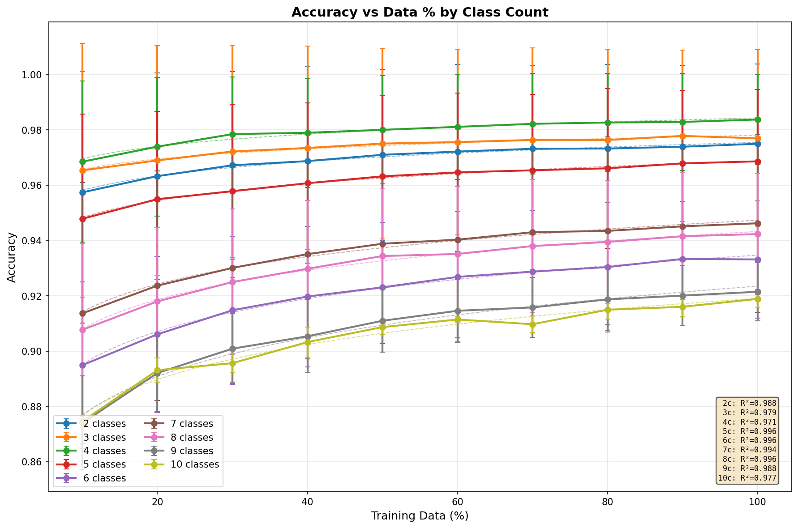

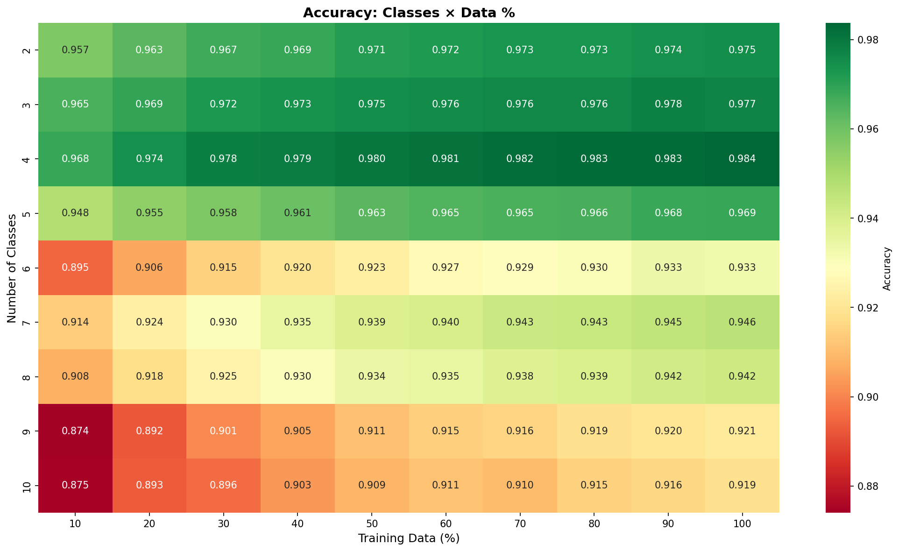

| func_type | equation                     | r_squared | x_min | x_max | efficiency_x | efficiency_y | efficiency_note | knee_x | knee_y  | knee_note    | marginal_x | marginal_y | marginal_note | marginal_thresh | old               | metric     | condition | num_classes |
|-----------|------------------------------|-----------|-------|-------|--------------|--------------|-----------------|--------|---------|--------------|------------|------------|---------------|-----------------|-------------------|------------|-----------|-------------|
| log       | y = 0.0075·log(x) + 0.9408   | 0.9882    | 10.0  | 100.0 | 11.0         | 0.9588       | analytical      | 39.1   | 0.9684  | max_distance | 75.25      | 0.9733     | dy/dx=0.0001  | 0.0001          | accuracy          | 2 classes  | 2         |             |
| log       | y = 0.0053·log(x) + 0.9534   | 0.9786    | 10.0  | 100.0 | 11.0         | 0.9662       | analytical      | 39.1   | 0.973   | max_distance | 53.4       | 0.9747     | dy/dx=0.0001  | 0.0001          | accuracy          | 3 classes  | 3         |             |
| log       | y = 0.0064·log(x) + 0.9549   | 0.9709    | 10.0  | 100.0 | 11.0         | 0.9702       | analytical      | 39.1   | 0.9783  | max_distance | 63.73      | 0.9814     | dy/dx=0.0001  | 0.0001          | accuracy          | 4 classes  | 4         |             |
| log       | y = 0.0089·log(x) + 0.9278   | 0.996     | 10.0  | 100.0 | 11.0         | 0.9491       | analytical      | 39.1   | 0.9604  | max_distance | 88.83      | 0.9677     | dy/dx=0.0001  | 0.0001          | accuracy          | 5 classes  | 5         |             |
| log       | y = 0.0172·log(x) + 0.8557   | 0.9958    | 10.0  | 100.0 | 11.0         | 0.8968       | analytical      | 39.1   | 0.9186  | max_distance | 100.0      | 0.9347     | not_reached   | 0.0001          | accuracy          | 6 classes  | 6         |             |
| log       | y = 0.0144·log(x) + 0.8811   | 0.9936    | 10.0  | 100.0 | 11.0         | 0.9156       | analytical      | 39.1   | 0.9338  | max_distance | 100.0      | 0.9473     | not_reached   | 0.0001          | accuracy          | 7 classes  | 7         |             |
| log       | y = 0.0153·log(x) + 0.8728   | 0.9956    | 10.0  | 100.0 | 11.0         | 0.9095       | analytical      | 39.1   | 0.9289  | max_distance | 100.0      | 0.9432     | not_reached   | 0.0001          | accuracy          | 8 classes  | 8         |             |
| log       | y = 0.0203·log(x) + 0.8300   | 0.9885    | 10.0  | 100.0 | 11.0         | 0.8787       | analytical      | 39.1   | 0.9044  | max_distance | 100.0      | 0.9235     | not_reached   | 0.0001          | accuracy          | 9 classes  | 9         |             |
| log       | y = 0.0182·log(x) + 0.8351   | 0.9769    | 10.0  | 100.0 | 11.0         | 0.8788       | analytical      | 39.1   | 0.902   | max_distance | 100.0      | 0.9191     | not_reached   | 0.0001          | accuracy          | 10 classes | 10        |             |
| log       | y = 0.0075·log(x) + 0.9408   | 0.9882    | 10.0  | 100.0 | 11.0         | 0.9588       | analytical      | 39.1   | 0.9684  | max_distance | 75.25      | 0.9733     | dy/dx=0.0001  | 0.0001          | balanced_accuracy | 2 classes  | 2         |             |
| log       | y = 0.0053·log(x) + 0.9534   | 0.9786    | 10.0  | 100.0 | 11.0         | 0.9662       | analytical      | 39.1   | 0.973   | max_distance | 53.4       | 0.9747     | dy/dx=0.0001  | 0.0001          | balanced_accuracy | 3 classes  | 3         |             |
| log       | y = 0.0064·log(x) + 0.9549   | 0.9709    | 10.0  | 100.0 | 11.0         | 0.9702       | analytical      | 39.1   | 0.9783  | max_distance | 63.73      | 0.9814     | dy/dx=0.0001  | 0.0001          | balanced_accuracy | 4 classes  | 4         |             |
| log       | y = 0.0089·log(x) + 0.9278   | 0.996     | 10.0  | 100.0 | 11.0         | 0.9491       | analytical      | 39.1   | 0.9604  | max_distance | 88.83      | 0.9677     | dy/dx=0.0001  | 0.0001          | balanced_accuracy | 5 classes  | 5         |             |
| log       | y = 0.0172·log(x) + 0.8557   | 0.9958    | 10.0  | 100.0 | 11.0         | 0.8968       | analytical      | 39.1   | 0.9186  | max_distance | 100.0      | 0.9347     | not_reached   | 0.0001          | balanced_accuracy | 6 classes  | 6         |             |
| log       | y = 0.0144·log(x) + 0.8811   | 0.9936    | 10.0  | 100.0 | 11.0         | 0.9156       | analytical      | 39.1   | 0.9338  | max_distance | 100.0      | 0.9473     | not_reached   | 0.0001          | balanced_accuracy | 7 classes  | 7         |             |
| log       | y = 0.0153·log(x) + 0.8728   | 0.9956    | 10.0  | 100.0 | 11.0         | 0.9095       | analytical      | 39.1   | 0.9289  | max_distance | 100.0      | 0.9432     | not_reached   | 0.0001          | balanced_accuracy | 8 classes  | 8         |             |
| log       | y = 0.0203·log(x) + 0.8300   | 0.9885    | 10.0  | 100.0 | 11.0         | 0.8787       | analytical      | 39.1   | 0.9044  | max_distance | 100.0      | 0.9235     | not_reached   | 0.0001          | balanced_accuracy | 9 classes  | 9         |             |
| log       | y = 0.0182·log(x) + 0.8351   | 0.9769    | 10.0  | 100.0 | 11.0         | 0.8788       | analytical      | 39.1   | 0.902   | max_distance | 100.0      | 0.9191     | not_reached   | 0.0001          | balanced_accuracy | 10 classes | 10        |             |
| log       | y = 0.0075·log(x) + 0.9407   | 0.9881    | 10.0  | 100.0 | 11.0         | 0.9588       | analytical      | 39.1   | 0.9684  | max_distance | 75.38      | 0.9733     | dy/dx=0.0001  | 0.0001          | f1_macro          | 2 classes  | 2         |             |
| log       | y = 0.0054·log(x) + 0.9533   | 0.9778    | 10.0  | 100.0 | 11.0         | 0.9661       | analytical      | 39.1   | 0.973   | max_distance | 53.73      | 0.9747     | dy/dx=0.0001  | 0.0001          | f1_macro          | 3 classes  | 3         |             |
| log       | y = 0.0063·log(x) + 0.9551   | 0.9709    | 10.0  | 100.0 | 11.0         | 0.9703       | analytical      | 39.1   | 0.9783  | max_distance | 63.46      | 0.9814     | dy/dx=0.0001  | 0.0001          | f1_macro          | 4 classes  | 4         |             |
| log       | y = 0.0090·log(x) + 0.9274   | 0.9963    | 10.0  | 100.0 | 11.0         | 0.9489       | analytical      | 39.1   | 0.9603  | max_distance | 89.68      | 0.9677     | dy/dx=0.0001  | 0.0001          | f1_macro          | 5 classes  | 5         |             |
| log       | y = 0.0172·log(x) + 0.8553   | 0.9956    | 10.0  | 100.0 | 11.0         | 0.8966       | analytical      | 39.1   | 0.9184  | max_distance | 100.0      | 0.9346     | not_reached   | 0.0001          | f1_macro          | 6 classes  | 6         |             |
| log       | y = 0.0143·log(x) + 0.8812   | 0.9939    | 10.0  | 100.0 | 11.0         | 0.9155       | analytical      | 39.1   | 0.9337  | max_distance | 100.0      | 0.9471     | not_reached   | 0.0001          | f1_macro          | 7 classes  | 7         |             |
| log       | y = 0.0154·log(x) + 0.8723   | 0.9954    | 10.0  | 100.0 | 11.0         | 0.9092       | analytical      | 39.1   | 0.9287  | max_distance | 100.0      | 0.9432     | not_reached   | 0.0001          | f1_macro          | 8 classes  | 8         |             |
| log       | y = 0.0202·log(x) + 0.8299   | 0.9887    | 10.0  | 100.0 | 11.0         | 0.8785       | analytical      | 39.1   | 0.9041  | max_distance | 100.0      | 0.9231     | not_reached   | 0.0001          | f1_macro          | 9 classes  | 9         |             |
| log       | y = 0.0184·log(x) + 0.8339   | 0.9763    | 10.0  | 100.0 | 11.0         | 0.8781       | analytical      | 39.1   | 0.9015  | max_distance | 100.0      | 0.9188     | not_reached   | 0.0001          | f1_macro          | 10 classes | 10        |             |
| log       | y = 0.0028·log(x) + 0.9819   | 0.9788    | 10.0  | 100.0 | 11.0         | 0.9886       | analytical      | 39.1   | 0.9921  | max_distance | 27.89      | 0.9912     | dy/dx=0.0001  | 0.0001          | auroc_macro       | 2 classes  | 2         |             |
| log       | y = 0.0016·log(x) + 0.9898   | 0.9792    | 10.0  | 100.0 | 11.0         | 0.9935       | analytical      | 39.1   | 0.9955  | max_distance | 15.72      | 0.9941     | dy/dx=0.0001  | 0.0001          | auroc_macro       | 3 classes  | 3         |             |
| log       | y = 0.0009·log(x) + 0.9949   | 0.9585    | 10.0  | 100.0 | 11.0         | 0.9971       | analytical      | 39.1   | 0.9982  | max_distance | 10.0       | 0.997      | dy/dx=0.0001  | 0.0001          | auroc_macro       | 4 classes  | 4         |             |
| log       | y = 0.0013·log(x) + 0.9918   | 0.9672    | 10.0  | 100.0 | 11.0         | 0.9948       | analytical      | 39.1   | 0.9964  | max_distance | 12.64      | 0.995      | dy/dx=0.0001  | 0.0001          | auroc_macro       | 5 classes  | 5         |             |
| log       | y = 0.0031·log(x) + 0.9805   | 0.9914    | 10.0  | 100.0 | 11.0         | 0.9878       | analytical      | 39.1   | 0.9917  | max_distance | 30.62      | 0.9909     | dy/dx=0.0001  | 0.0001          | auroc_macro       | 6 classes  | 6         |             |
| log       | y = 0.0021·log(x) + 0.9865   | 0.9888    | 10.0  | 100.0 | 11.0         | 0.9916       | analytical      | 39.1   | 0.9943  | max_distance | 21.23      | 0.993      | dy/dx=0.0001  | 0.0001          | auroc_macro       | 7 classes  | 7         |             |
| log       | y = 0.0019·log(x) + 0.9881   | 0.9877    | 10.0  | 100.0 | 11.0         | 0.9926       | analytical      | 39.1   | 0.995   | max_distance | 18.67      | 0.9936     | dy/dx=0.0001  | 0.0001          | auroc_macro       | 8 classes  | 8         |             |
| log       | y = 0.0025·log(x) + 0.9836   | 0.9838    | 10.0  | 100.0 | 11.0         | 0.9897       | analytical      | 39.1   | 0.9929  | max_distance | 25.48      | 0.9918     | dy/dx=0.0001  | 0.0001          | auroc_macro       | 9 classes  | 9         |             |
| log       | y = 0.0023·log(x) + 0.9847   | 0.9872    | 10.0  | 100.0 | 11.0         | 0.9903       | analytical      | 39.1   | 0.9932  | max_distance | 23.1       | 0.992      | dy/dx=0.0001  | 0.0001          | auroc_macro       | 10 classes | 10        |             |
| log       | y = 0.0028·log(x) + 0.9820   | 0.98      | 10.0  | 100.0 | 11.0         | 0.9887       | analytical      | 39.1   | 0.9922  | max_distance | 27.95      | 0.9913     | dy/dx=0.0001  | 0.0001          | auprc_macro       | 2 classes  | 2         |             |
| log       | y = 0.0030·log(x) + 0.9805   | 0.9757    | 10.0  | 100.0 | 11.0         | 0.9877       | analytical      | 39.1   | 0.9915  | max_distance | 29.87      | 0.9907     | dy/dx=0.0001  | 0.0001          | auprc_macro       | 3 classes  | 3         |             |
| log       | y = 0.0025·log(x) + 0.9860   | 0.9577    | 10.0  | 100.0 | 11.0         | 0.9919       | analytical      | 39.1   | 0.995   | max_distance | 24.65      | 0.9939     | dy/dx=0.0001  | 0.0001          | auprc_macro       | 4 classes  | 4         |             |
| log       | y = 0.0040·log(x) + 0.9731   | 0.9755    | 10.0  | 100.0 | 11.0         | 0.9826       | analytical      | 39.1   | 0.9877  | max_distance | 40.0       | 0.9878     | dy/dx=0.0001  | 0.0001          | auprc_macro       | 5 classes  | 5         |             |
| log       | y = 0.0120·log(x) + 0.9222   | 0.9916    | 10.0  | 100.0 | 11.0         | 0.9509       | analytical      | 39.1   | 0.966   | max_distance | 100.0      | 0.9773     | not_reached   | 0.0001          | auprc_macro       | 6 classes  | 6         |             |
| log       | y = 0.0092·log(x) + 0.9394   | 0.9885    | 10.0  | 100.0 | 11.0         | 0.9616       | analytical      | 39.1   | 0.9733  | max_distance | 92.44      | 0.9813     | dy/dx=0.0001  | 0.0001          | auprc_macro       | 7 classes  | 7         |             |
| log       | y = 0.0100·log(x) + 0.9353   | 0.9878    | 10.0  | 100.0 | 11.0         | 0.9593       | analytical      | 39.1   | 0.9719  | max_distance | 99.75      | 0.9812     | dy/dx=0.0001  | 0.0001          | auprc_macro       | 8 classes  | 8         |             |
| log       | y = 0.0144·log(x) + 0.9044   | 0.9873    | 10.0  | 100.0 | 11.0         | 0.9388       | analytical      | 39.1   | 0.957   | max_distance | 100.0      | 0.9705     | not_reached   | 0.0001          | auprc_macro       | 9 classes  | 9         |             |
| log       | y = 0.0143·log(x) + 0.9020   | 0.9874    | 10.0  | 100.0 | 11.0         | 0.9364       | analytical      | 39.1   | 0.9545  | max_distance | 100.0      | 0.968      | not_reached   | 0.0001          | auprc_macro       | 10 classes | 10        |             |
| log       | y = 0.0149·log(x) + 0.8825   | 0.9886    | 10.0  | 100.0 | 11.0         | 0.9182       | analytical      | 39.1   | 0.9371  | max_distance | 100.0      | 0.951      | not_reached   | 0.0001          | mcc               | 2 classes  | 2         |             |
| log       | y = 0.0079·log(x) + 0.9308   | 0.98      | 10.0  | 100.0 | 11.0         | 0.9497       | analytical      | 39.1   | 0.9597  | max_distance | 78.9       | 0.9652     | dy/dx=0.0001  | 0.0001          | mcc               | 3 classes  | 3         |             |
| log       | y = 0.0084·log(x) + 0.9402   | 0.9716    | 10.0  | 100.0 | 11.0         | 0.9604       | analytical      | 39.1   | 0.9711  | max_distance | 84.41      | 0.9776     | dy/dx=0.0001  | 0.0001          | mcc               | 4 classes  | 4         |             |
| log       | y = 0.0111·log(x) + 0.9101   | 0.9957    | 10.0  | 100.0 | 11.0         | 0.9366       | analytical      | 39.1   | 0.9506  | max_distance | 100.0      | 0.961      | not_reached   | 0.0001          | mcc               | 5 classes  | 5         |             |
| log       | y = 0.0204·log(x) + 0.8279   | 0.996     | 10.0  | 100.0 | 11.0         | 0.8767       | analytical      | 39.1   | 0.9026  | max_distance | 100.0      | 0.9217     | not_reached   | 0.0001          | mcc               | 6 classes  | 6         |             |
| log       | y = 0.0167·log(x) + 0.8618   | 0.9935    | 10.0  | 100.0 | 11.0         | 0.9018       | analytical      | 39.1   | 0.923   | max_distance | 100.0      | 0.9386     | not_reached   | 0.0001          | mcc               | 7 classes  | 7         |             |
| log       | y = 0.0174·log(x) + 0.8551   | 0.9958    | 10.0  | 100.0 | 11.0         | 0.8968       | analytical      | 39.1   | 0.9189  | max_distance | 100.0      | 0.9352     | not_reached   | 0.0001          | mcc               | 8 classes  | 8         |             |
| log       | y = 0.0226·log(x) + 0.8097   | 0.9887    | 10.0  | 100.0 | 11.0         | 0.864        | analytical      | 39.1   | 0.8927  | max_distance | 100.0      | 0.914      | not_reached   | 0.0001          | mcc               | 9 classes  | 9         |             |
| log       | y = 0.0202·log(x) + 0.8173   | 0.9774    | 10.0  | 100.0 | 11.0         | 0.8657       | analytical      | 39.1   | 0.8913  | max_distance | 100.0      | 0.9102     | not_reached   | 0.0001          | mcc               | 10 classes | 10        |             |
| log       | y = 0.0074·log(x) + 0.9417   | 0.9888    | 10.0  | 100.0 | 11.0         | 0.9593       | analytical      | 39.1   | 0.9687  | max_distance | 73.51      | 0.9733     | dy/dx=0.0001  | 0.0001          | precision_macro   | 2 classes  | 2         |             |
| log       | y = 0.0052·log(x) + 0.9544   | 0.9811    | 10.0  | 100.0 | 11.0         | 0.9667       | analytical      | 39.1   | 0.9733  | max_distance | 51.54      | 0.9747     | dy/dx=0.0001  | 0.0001          | precision_macro   | 3 classes  | 3         |             |
| log       | y = 0.0061·log(x) + 0.9560   | 0.974     | 10.0  | 100.0 | 11.0         | 0.9707       | analytical      | 39.1   | 0.9785  | max_distance | 61.49      | 0.9813     | dy/dx=0.0001  | 0.0001          | precision_macro   | 4 classes  | 4         |             |
| log       | y = 0.0089·log(x) + 0.9281   | 0.9955    | 10.0  | 100.0 | 11.0         | 0.9494       | analytical      | 39.1   | 0.9607  | max_distance | 88.93      | 0.968      | dy/dx=0.0001  | 0.0001          | precision_macro   | 5 classes  | 5         |             |
| log       | y = 0.0162·log(x) + 0.8601   | 0.9965    | 10.0  | 100.0 | 11.0         | 0.899        | analytical      | 39.1   | 0.9196  | max_distance | 100.0      | 0.9348     | not_reached   | 0.0001          | precision_macro   | 6 classes  | 6         |             |
| log       | y = 0.0137·log(x) + 0.8844   | 0.9938    | 10.0  | 100.0 | 11.0         | 0.9172       | analytical      | 39.1   | 0.9346  | max_distance | 100.0      | 0.9474     | not_reached   | 0.0001          | precision_macro   | 7 classes  | 7         |             |
| log       | y = 0.0148·log(x) + 0.8754   | 0.9958    | 10.0  | 100.0 | 11.0         | 0.911        | analytical      | 39.1   | 0.9298  | max_distance | 100.0      | 0.9437     | not_reached   | 0.0001          | precision_macro   | 8 classes  | 8         |             |
| log       | y = 0.0188·log(x) + 0.8369   | 0.9913    | 10.0  | 100.0 | 11.0         | 0.882        | analytical      | 39.1   | 0.9058  | max_distance | 100.0      | 0.9234     | not_reached   | 0.0001          | precision_macro   | 9 classes  | 9         |             |
| log       | y = 0.0179·log(x) + 0.8372   | 0.9798    | 10.0  | 100.0 | 11.0         | 0.8802       | analytical      | 39.1   | 0.903   | max_distance | 100.0      | 0.9198     | not_reached   | 0.0001          | precision_macro   | 10 classes | 10        |             |
| log       | y = 0.0075·log(x) + 0.9408   | 0.9882    | 10.0  | 100.0 | 11.0         | 0.9588       | analytical      | 39.1   | 0.9684  | max_distance | 75.25      | 0.9733     | dy/dx=0.0001  | 0.0001          | recall_macro      | 2 classes  | 2         |             |
| log       | y = 0.0053·log(x) + 0.9534   | 0.9786    | 10.0  | 100.0 | 11.0         | 0.9662       | analytical      | 39.1   | 0.973   | max_distance | 53.4       | 0.9747     | dy/dx=0.0001  | 0.0001          | recall_macro      | 3 classes  | 3         |             |
| log       | y = 0.0064·log(x) + 0.9549   | 0.9709    | 10.0  | 100.0 | 11.0         | 0.9702       | analytical      | 39.1   | 0.9783  | max_distance | 63.73      | 0.9814     | dy/dx=0.0001  | 0.0001          | recall_macro      | 4 classes  | 4         |             |
| log       | y = 0.0089·log(x) + 0.9278   | 0.996     | 10.0  | 100.0 | 11.0         | 0.9491       | analytical      | 39.1   | 0.9604  | max_distance | 88.83      | 0.9677     | dy/dx=0.0001  | 0.0001          | recall_macro      | 5 classes  | 5         |             |
| log       | y = 0.0172·log(x) + 0.8557   | 0.9958    | 10.0  | 100.0 | 11.0         | 0.8968       | analytical      | 39.1   | 0.9186  | max_distance | 100.0      | 0.9347     | not_reached   | 0.0001          | recall_macro      | 6 classes  | 6         |             |
| log       | y = 0.0144·log(x) + 0.8811   | 0.9936    | 10.0  | 100.0 | 11.0         | 0.9156       | analytical      | 39.1   | 0.9338  | max_distance | 100.0      | 0.9473     | not_reached   | 0.0001          | recall_macro      | 7 classes  | 7         |             |
| log       | y = 0.0153·log(x) + 0.8728   | 0.9956    | 10.0  | 100.0 | 11.0         | 0.9095       | analytical      | 39.1   | 0.9289  | max_distance | 100.0      | 0.9432     | not_reached   | 0.0001          | recall_macro      | 8 classes  | 8         |             |
| log       | y = 0.0203·log(x) + 0.8300   | 0.9885    | 10.0  | 100.0 | 11.0         | 0.8787       | analytical      | 39.1   | 0.9044  | max_distance | 100.0      | 0.9235     | not_reached   | 0.0001          | recall_macro      | 9 classes  | 9         |             |
| log       | y = 0.0182·log(x) + 0.8351   | 0.9769    | 10.0  | 100.0 | 11.0         | 0.8788       | analytical      | 39.1   | 0.902   | max_distance | 100.0      | 0.9191     | not_reached   | 0.0001          | recall_macro      | 10 classes | 10        |             |
| power     | y = 0.0000·x^6.8344 + 9.9213 | 0.8837    | 2.0   | 10.0  | 2.0          | 9.9217       | numerical       | 7.48   | 13.6609 | max_distance |            |            | not_found     | 0.0001          | iso_accuracy      | 90% target |           |             |
| log       | y = -0.0449·log(x) + 1.0203  | 0.7416    | 2.0   | 10.0  | 10.0         | 0.917        | analytical      | 10.0   | 0.917   | max_distance | 2.0        | 0.9892     | dy/dx=0.0001  | 0.0001          | scaling_law       | 50% data   |           |             |
| log       | y = -0.0398·log(x) + 1.0186  | 0.7373    | 2.0   | 10.0  | 10.0         | 0.927        | analytical      | 10.0   | 0.927   | max_distance | 2.0        | 0.991      | dy/dx=0.0001  | 0.0001          | scaling_law       | 100% data  |           |             |
Table (?): 

### 4. Discussion and Interpretation
...

### 5. Conclusion
In conclusion, it is typical for a model training process to attempt to use all the data available, however this does not 
imply that all data available is needed to train a sufficiently good model. Model performance can be much closely tied to fine 
tuning methods than to the scaling of data set size beyond a certain threshold. This diminishing returns effect becomes more 
adversarial on model performance when measured in conjunction with added noise (see experiment 2). The difficulty of the task 
the model is expected to perform (eg. number of classes to differentiate between) also factors into the amount of data needed (see experiment 3).

### 6. Appendix

#### 6.1 Additional Figures

##### 6.1.1 Experiment 1: Simple Diminishing Returns

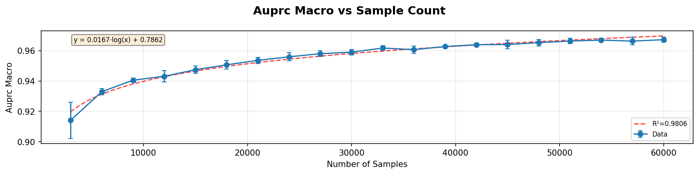

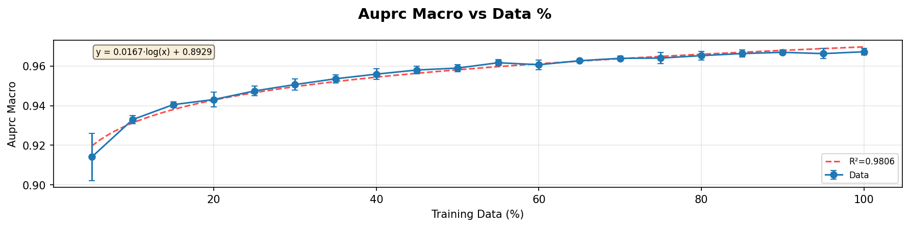

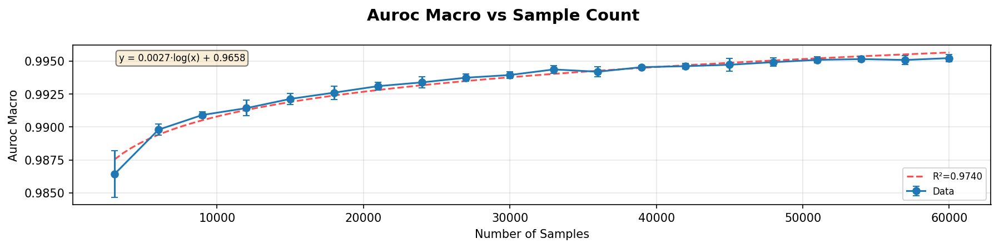

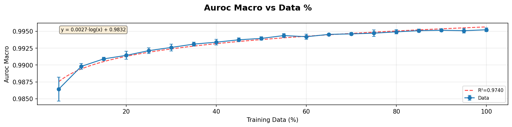

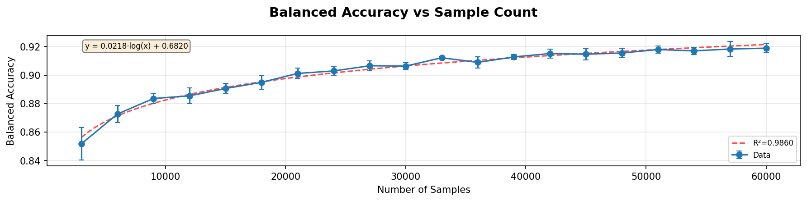

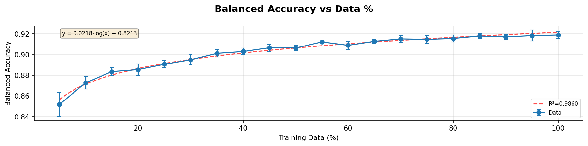

Since the data set is relatively balanced, the graphs for balanced accuracy is visually near identical to the non-balanced default.

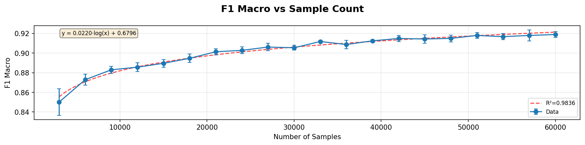

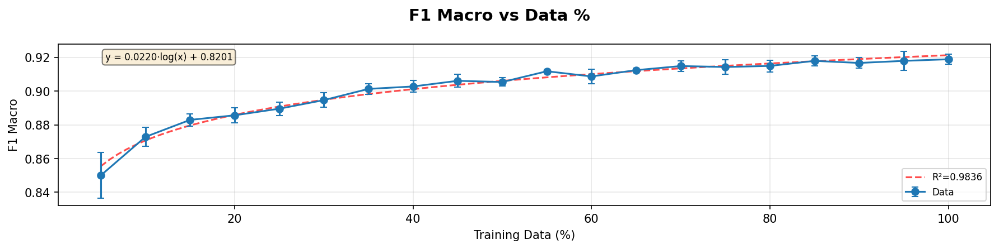

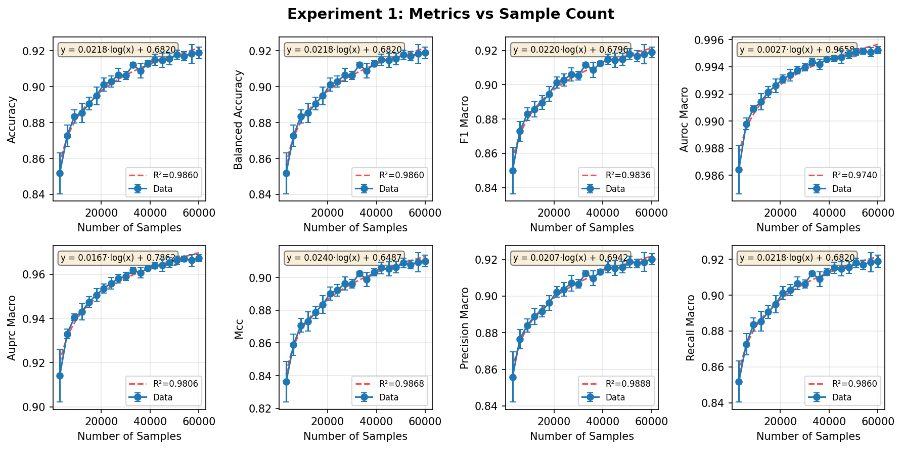

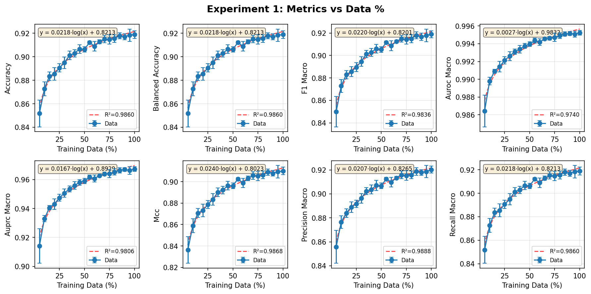

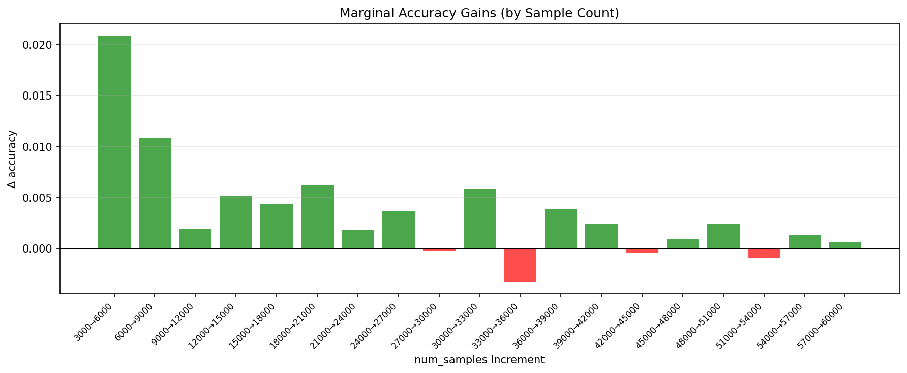

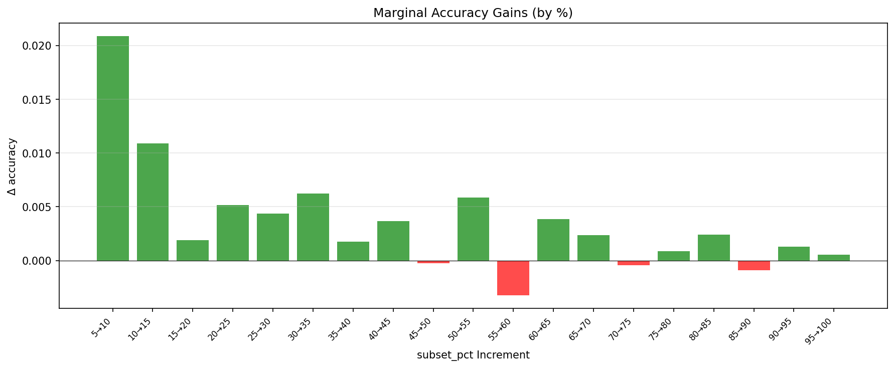

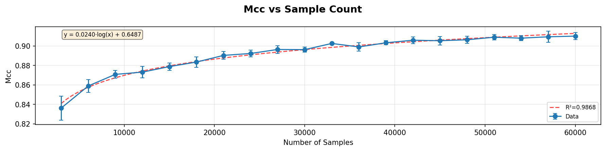

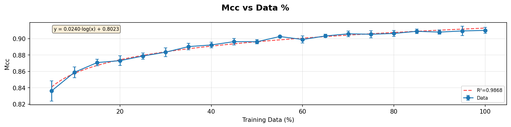

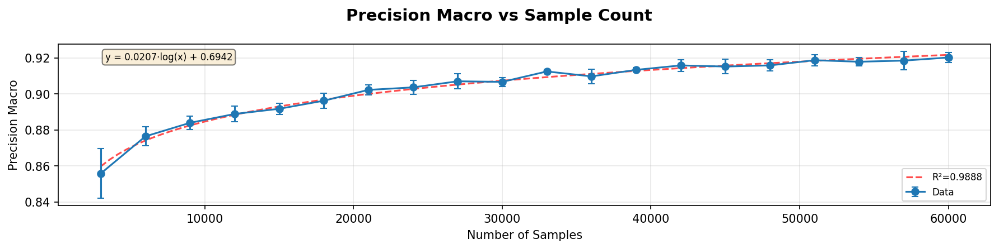

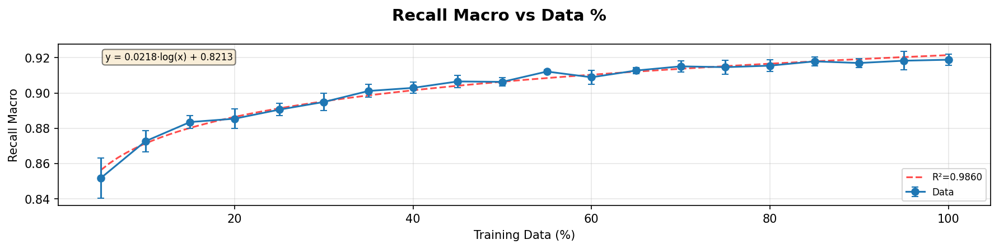

##### 6.1.2 Experiment 2: Diminishing Returns with Added Noise

##### 6.1.3 Experiment 3: Diminishing Returns measured with respect to Number of Classes in Classifer Model

#### 6.2 Reference LIst
https://link.springer.com/article/10.1007/s11263-015-0812-2
https://www.tandfonline.com/doi/abs/10.1080/01431169508954507
https://proceedings.mlr.press/r1/oates97b.html
https://www.sciencedirect.com/science/article/pii/S0341816216302090
https://www.sciencedirect.com/science/article/pii/S0895435618310813
https://www.sciencedirect.com/science/article/pii/S0034425705002750
https://link.springer.com/article/10.1186/bcr2468
https://www.mdpi.com/2072-4292/13/3/368
https://dl.acm.org/doi/abs/10.1145/1390156.1390273
https://www.sciencedirect.com/science/article/pii/S0165993606002330
https://www.sciencedirect.com/science/article/pii/S1574954120300352
https://www.sciencedirect.com/science/article/pii/S0034425706001234
https://www.mdpi.com/1420-3049/26/4/1111
https://elar.khmnu.edu.ua/items/a5d0d900-449d-4f3d-b800-c7200084384f
https://ufal.mff.cuni.cz/books/preview/2018-zeman_full.pdf
https://aclanthology.org/D14-1096.pdf
https://www.sciencedirect.com/science/article/pii/S1470160X14002088
https://esajournals.onlinelibrary.wiley.com/doi/epdf/10.1002/ecs2.70205

how many tokens in chatgpt's model:
https://explodingtopics.com/blog/gpt-parameters 

How much data exists in the world:
https://www.sciencefocus.com/future-technology/how-much-data-is-on-the-internet